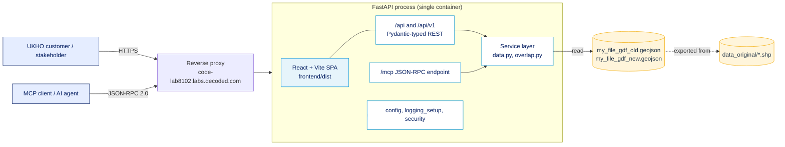
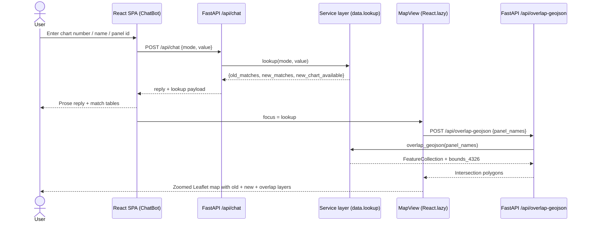
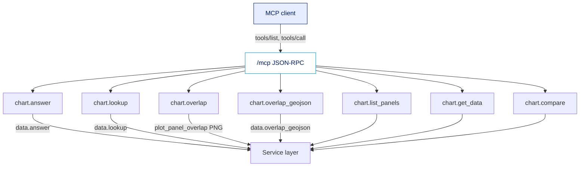
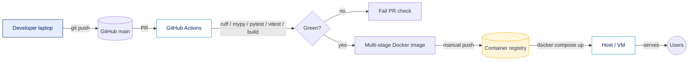

# Architecture

## Context diagram

## Request flow — chart lookup

## MCP tool catalogue

## Deployment

## Component boundaries

| Layer | Location | Responsibility |
|-------|----------|----------------|
| SPA | `frontend/src/App.jsx`, `frontend/src/MapView.jsx` | ChatBot, MapView, MCPChat, routing, a11y |
| REST | `src/autochart/backend/api/routes.py` | Pydantic-typed endpoints, `/api` and `/api/v1` alias |
| MCP | `src/autochart/backend/mcp_server.py` | JSON-RPC dispatcher, tool schema, image content |
| Service | `src/autochart/backend/data.py`, `overlap.py` | Lookup, GeoJSON, matplotlib overlap PNG |
| Cross-cutting | `config.py`, `logging_setup.py`, `security.py`, `main.py` | Env config, structlog, API-key middleware, SPA static + SPA fallback |
| Data | Repo root `my_file_gdf_*.geojson`, `data_original/*.shp` | Old/new panel geometry (EPSG:4326 / native CRS) |
