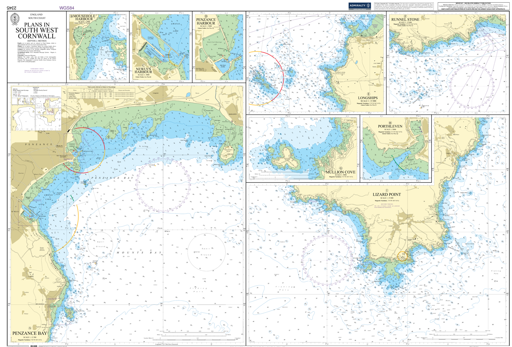
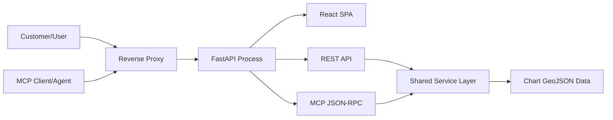
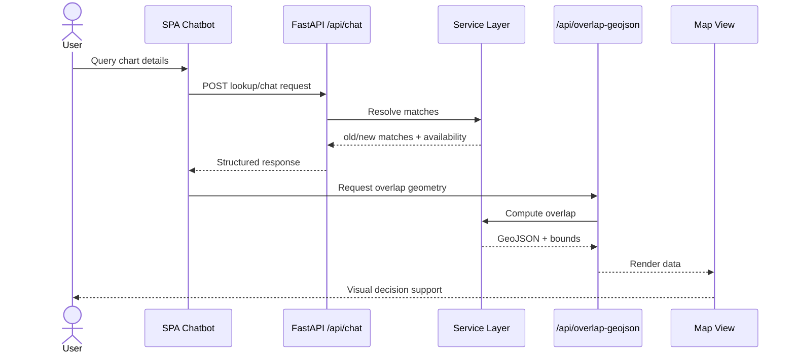
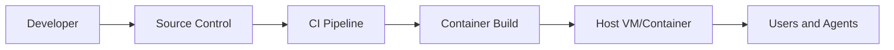
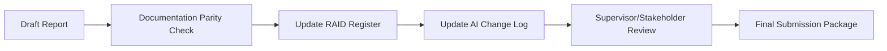
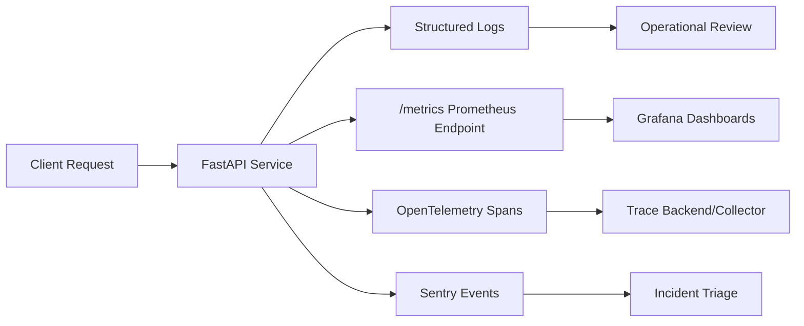
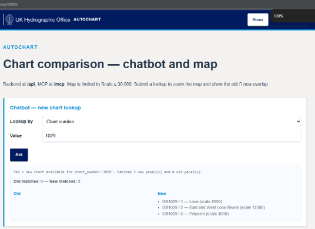
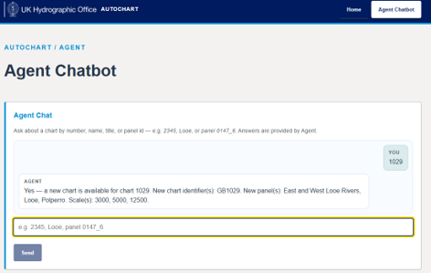
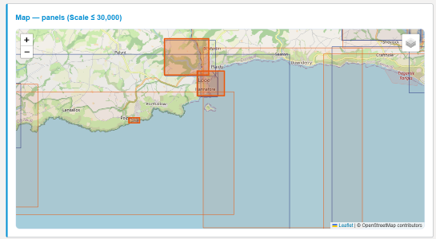
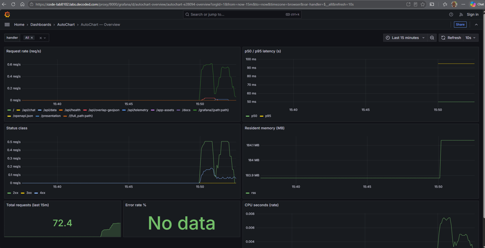

# AutoChart: Graduation Project Report

## Title Page

**Project Title:** AutoChart - Intelligent Chart-Upgrade Decision Support for UKHO Geospatial Navigation Products  
**Programme:** Graduation Project  
**Institution:** Decoded / UKHO Collaboration Context  
**Candidate:** 
- Nilesh Wairagade (UKHO)  
- Sakirat Usman (NHS)  
**Submission Date:** 10 August 2026  
**Version:** 1.0

---

## Acknowledgements

We wish to express our sincere gratitude to the UK Hydrographic Office stakeholders and technical mentors, especially Mike Stitfall (Project Manager), Thomas Redfern (Senior Data Scientist), Stuart Osborne (Senior Business Analyst), and Nicholas Hill (Solution Architect), who supported us from inception to delivery of this project. Their practical guidance, constructive scrutiny, and domain insight shaped this work at every stage.

We also thank Andy Poole (Head of Engineering) for his support during this programme, as well as the wider data community whose open-source tools made rigorous geospatial analysis possible, and our peers whose reviews sharpened both the design and the narrative.

Like a lighthouse in poor visibility, timely feedback from reviewers repeatedly illuminated the safest route forward.

---

## Abstract

This report presents AutoChart, a full-stack application that helps UKHO customers determine whether their currently owned geospatial paper charts have meaningful updates in newer releases. The system compares old and new chart polygons, surfaces likely upgrades, and provides access through both a web chatbot and an MCP-compatible machine interface.

The implemented architecture uses a single FastAPI process to serve a React single-page application, typed REST endpoints, and JSON-RPC MCP tools. Geospatial workflows are built with Geopandas, Pandas, and Shapely, while visual overlap evidence is generated server-side and rendered client-side for interpretation.

Evaluation evidence includes automated backend and frontend test suites, typed API contracts, and observability instrumentation. The resulting system demonstrates that chart-update decision support can be delivered as a coherent, practical platform rather than a collection of disconnected scripts.

The project progressed with an irony common to modern engineering: reducing complexity required adding deliberate structure. By consolidating interfaces into one process and one service layer, operational burden was lowered while capability increased.

---

## Contents

1. Chapter 1: Introduction  
2. Chapter 2: Business Case  
3. Chapter 3: Architecture  
4. Chapter 4: Methodology  
5. Chapter 5: Data Handling  
6. Chapter 6: RAID Register for Graduation Governance  
7. Chapter 7: REST API, MCP, and Observability Delivery  
8. Chapter 8: Project Delivery  
9. Chapter 9: Conclusion  
10. Chapter 10: References  
11. Chapter 11: Appendices

---

## List of Figures

- Figure 0: UKHO brand mark used in project materials
- Figure 1: Current paper chart in use (example 1)
- Figure 2: System context and delivery boundaries
- Figure 3: End-to-end chart lookup and overlap workflow
- Figure 4: Single-process deployment pattern
- Figure 5: RAID governance flow for graduation submission
- Figure 6: Observability signal pipeline
- Figure 7: App front page
- Figure 8: App chatbot
- Figure 9: Map comparison of old vs new
- Figure 10: Grafana dashboard

---

## List of Tables

- Table 1: Functional requirements and implemented responses
- Table 2: Technology stack and rationale
- Table 3: Business impact analysis
- Table 4: Risks, mitigations, and residual exposure
- Table 5: Graduation RAID summary (current state)
- Table 6: REST API capability and validation evidence
- Table 7: MCP tool catalogue and validation evidence
- Table 8: Observability baseline and operational outcomes
- Table 9: Containerisation and CI/CD delivery evidence

---

## Chapter 1: Introduction

### 1.1 Background

UK Hydrographic Office (UKHO) customers need confidence that their chart holdings remain current. Historically, identifying update-worthy changes between chart versions has required manual inspection of geospatial artefacts, often across several toolchains. This is time-consuming, error-prone, and difficult to scale.

AutoChart SPA page with MCP and API addresses this gap by comparing old and new chart schemes and producing actionable recommendations. The solution supports both human users (through a web chatbot and map) and machine users (through MCP tools).

Current charts are shown below. These require a comparison tool so customers can make a business decision on whether to buy a new chart. Each chart not only shows a full-scale map but also various panels within the chart at reduced scale for better navigation.

### 1.2 Problem Statement

The core problem is not merely detecting geometric difference, but translating difference into decision support. A raw polygon delta is insufficient unless it can be interpreted in an operational context.

### 1.3 Objectives

- Build a robust comparison service for old vs new chart geometries.
- Provide intuitive web access for exploratory decision-making.
- Provide MCP access for automation and agent workflows.
- Maintain security, observability, and testability standards suitable for a production trajectory.

### 1.4 Scope

In scope:
- Polygon-based lookup and overlap analysis.
- REST and MCP interfaces over a shared service layer.
- Visual inspection support via map overlays and overlap artefacts.

Out of scope:
- Final policy arbitration for what constitutes an "upgrade-worthy" change across every business scenario.
- Full enterprise identity and access management integration.

### 1.5 Contribution

The principal contribution is an integrated platform where data engineering, backend API design, frontend interpretation, and operational controls converge. The architecture behaves like a bridge: one side anchored in geospatial evidence, the other in user decision-making.

---

## Chapter 2: Business Case

### 2.1 Value Proposition

AutoChart reduces the cognitive and operational load of chart update assessment. Instead of manually reconciling multiple geospatial views, users receive consolidated evidence and guided outputs.

### 2.2 Stakeholder Benefits

- Customers: quicker clarity on potential upgrades.
- Analysts: stronger evidence trail for recommendations.
- Engineering teams: reusable machine interface for integrations.
- Product leadership: demonstrable pathway from prototype to operational service.

### 2.3 Cost-Benefit Narrative

Manual review scales linearly with analyst effort; platform-assisted triage changes the curve by automating repetitive checks and reserving expert judgement for exceptions.

### 2.4 Strategic Fit

The project aligns with digital transformation priorities by combining geospatial intelligence with interoperable APIs. The outcome is not merely technical novelty; it is practical decision support.

### 2.5 Impact Summary

**Table 3. Business impact analysis**

| Dimension | Before AutoChart | After AutoChart |
| --- | --- | --- |
| Update detection | Manual, fragmented | Assisted, consolidated |
| Evidence accessibility | Tool-dependent | API and web channels |
| Consistency | Analyst-variable | Service-layer governed |
| Extensibility | Limited | MCP-ready integration path |

Metaphorically, the platform acts as an air-traffic controller for chart evidence: it does not fly the aircraft, but it helps every route stay safe, timely, and intelligible.

---

## Chapter 3: Architecture

### 3.1 Architectural Overview

AutoChart follows a single-process architecture in which FastAPI serves:
- the React SPA,
- REST endpoints,
- MCP JSON-RPC endpoint.

This decision minimises cross-origin complexity and reduces deployment surface area.

### 3.2 Architectural Principles

- Single source of truth in the service layer.
- Interface parity between REST and MCP tools.
- Progressive hardening via tests and policy gates.
- Observable-by-default runtime characteristics.

### 3.3 System Context

**Figure 2. System context and delivery boundaries**

### 3.4 Request Flow

**Figure 3. End-to-end chart lookup and overlap workflow**

### 3.5 Deployment Pattern

**Figure 4. Single-process deployment pattern**

### 3.6 Requirement-to-Design Traceability

**Table 1. Functional requirements and implemented responses**

| Requirement | Design Response | Evidence |
| --- | --- | --- |
| Identify chart updates | Shared geospatial lookup service | REST `/api/lookup`, MCP `chart.lookup` |
| Visualise spatial differences | Map layers and overlap outputs | `/api/data`, `/api/overlap`, `/api/overlap-geojson` |
| Enable automation | MCP JSON-RPC endpoint | `/mcp`, `tools/list`, `tools/call` |
| Support robust operations | Health probes, metrics, logging | `/livez`, `/healthz`, `/metrics` |

### 3.7 Technology Selection

**Table 2. Technology stack and rationale**

| Component | Technology | Rationale |
| --- | --- | --- |
| Backend runtime | Python 3.13 + FastAPI | Strong typing and rapid API delivery |
| Geospatial engine | Geopandas, Pandas, Shapely | Mature polygon operations |
| Frontend | React 18 + Vite | Fast iteration and modern UX |
| Mapping | Leaflet + react-leaflet | Practical web map rendering |
| Observability | Prometheus, OpenTelemetry, Sentry | Progressive production readiness |
| Tooling | Ruff, MyPy, Pytest, Vitest | Quality and regression control |

Alliteration is purposeful here: clear contracts, coherent components, and continuous checks.

### 3.8 REST API Architecture and Contract Design

The REST API is implemented under `/api` with a stable contract-first approach through typed request/response schemas. Endpoint design focuses on distinct operational intents: health checks, lookup retrieval, geometry transfer, and overlap computation. This separation supports predictable client integration and test isolation.

Design characteristics:
- typed payloads to reduce ambiguity in client calls,
- explicit scale filters for bounded geospatial workloads,
- route-level clarity between read endpoints (GET) and computation endpoints (POST).

### 3.9 MCP Architecture and Tooling Surface

The MCP endpoint (`/mcp`) provides JSON-RPC 2.0 interoperability for agent-driven workflows. Crucially, MCP calls use the same service layer as REST routes, ensuring behavioural parity.

Architectural outcomes:
- one business-logic core, two transport surfaces,
- lower risk of contract drift,
- easier governance because fixes in service code propagate to both interfaces.

### 3.10 Observability Architecture

Observability is treated as a first-class system capability rather than an afterthought. The baseline combines metrics, traces, and error reporting, with environment-gated activation to keep local development lightweight.

The current instrumentation model includes:
- liveness and readiness probes (`/livez`, `/healthz`),
- Prometheus metrics (`/metrics`),
- OpenTelemetry hooks for distributed tracing,
- Sentry integration for managed exception capture,
- structured logs with request correlation.

### 3.11 UKHO Design System and CSS Policy Alignment

The frontend styling approach was aligned to UKHO visual guidance and CSS policy expectations. The implementation uses Admiralty-aligned design tokens and branding references as captured in ADR 0002, with local CSS variables chosen to preserve consistency without introducing unnecessary runtime dependency overhead.

Policy alignment points:
- CSS decisions were guided by the UKHO CSS Coding Standards.
- Frontend presentation choices were aligned with UKHO Front End Policy expectations.
- Admiralty design-system guidance informed palette, typography direction, and component styling consistency.

This alignment ensured that the app's visual language remained coherent with UKHO policy while still being practical for a graduation-project codebase.

---

## Chapter 4: Methodology

### 4.1 Delivery Approach

The project used iterative, evidence-led delivery. Each increment was verified through tests and documentation before broadening scope. This avoided brittle acceleration and preserved traceability.

### 4.2 Engineering Workflow

- Define requirement slice and acceptance criteria.
- Implement service-layer behaviour.
- Expose behaviour via REST and MCP.
- Validate with unit/integration tests.
- Integrate frontend interaction and map rendering.
- Harden security and observability pathways.

### 4.3 Quality Assurance Strategy

- Backend tests cover API, data services, overlap logic, MCP methods, and security controls.
- Frontend tests validate chatbot interactions, map states, and MCP chat pathways.
- Static checks enforce style and consistency.
- CI gates reduce regression risk.

### 4.4 Research and Validation Methods

- Comparative geospatial checks between old and new datasets.
- Scenario testing using chart number, name, title, and panel identifiers.
- Operational validation through health endpoints and metrics.

The development cadence moved like a relay race: each stage handed verified output to the next, rather than passing uncertainty downstream.

### 4.5 Interface and Operational Validation (REST, MCP, Observability)

Validation was performed across three delivery tracks:
- REST track: endpoint-level tests for lookup, data retrieval, overlap operations, and chat pathways.
- MCP track: JSON-RPC tests for `initialize`, `tools/list`, and `tools/call`, including tool behaviour parity and error pathways.
- Observability track: verification of probe endpoints and instrumentation availability, with policy-aligned logging for traceability.

This tri-track approach ensured that feature completion was not accepted unless it was simultaneously testable, automatable, and monitorable.

---

## Chapter 5: Data Handling

### 5.1 Data Sources

Primary geospatial sources are the chart scheme shapefiles in the project dataset bundle. For runtime efficiency and portability, the backend consumes prepared GeoJSON exports derived from those sources.

### 5.2 Data Preparation Pipeline

- Read source shapefiles.
- Normalise and extract required fields.
- Export deterministic GeoJSON artefacts for application use.
- Enforce scale constraints (default threshold used for relevant operations).

### 5.3 Data Quality and Integrity

Key controls include:
- preservation of old/new schema context,
- consistent identifier handling,
- bounded filtering for operationally relevant scales,
- explicit test coverage of lookup and overlap behaviours.

### 5.4 Geospatial Computation

The overlap pipeline computes intersection evidence for selected panels and returns either image-based or GeoJSON-based artefacts, depending on client need.

### 5.5 Security and Governance Considerations

- API key middleware supports controlled access when enabled.
- Public routes are intentionally scoped.
- CI vulnerability scanning supports early detection.
- Structured logging improves auditability.

### 5.6 Risk Posture

**Table 4. Risks, mitigations, and residual exposure**

| Risk Area | Mitigation | Residual Exposure |
| --- | --- | --- |
| CRS mismatch | Normalisation and validation workflow | Medium until fully automated |
| Large polygon processing cost | Filtering, service design, future indexing options | Medium |
| API exposure in public environments | Configurable CORS and API-key middleware | Low/Medium depending on deployment |
| Contract drift across interfaces | Shared service layer + tests | Low |

---

## Chapter 6: RAID Register for Graduation Governance

To align the report with delivery governance, RAID entries have been explicitly incorporated into the graduation narrative.

### 6.1 RAID Purpose in This Submission

The RAID register is used to make decision risk visible, assumptions testable, issues traceable, and external dependencies explicit. In practical terms, it prevents the report from becoming a static story detached from project reality.

### 6.2 Current RAID Snapshot

**Table 5. Graduation RAID summary (current state)**

| Category | Key Current Entry | Status | Intended Control |
| --- | --- | --- | --- |
| Risk | R-010: report/implementation drift before submission | Monitoring | Final parity review against README, ADRs, and architecture docs |
| Assumption | A-005: Mermaid and markdown tables accepted by assessors | Monitoring | Supervisor validation and export preview |
| Issue | I-005: governance linkage incomplete in earlier report draft | Closed | AI/RAID log completion and report integration |
| Dependency | D-008: supervisor citation/format sign-off | Open | Confirm submission format requirements before final hand-in |

### 6.3 RAID Integration Workflow

**Figure 5. RAID governance flow for graduation submission**

### 6.4 Interpretation

The present RAID state indicates no blocker severe enough to prevent submission preparation, but it does require one final governance checkpoint. Ironically, the final document became stronger only after treating documentation quality as an engineering problem in its own right.

---

## Chapter 7: REST API, MCP, and Observability Delivery

This chapter presents the missing implementation detail explicitly and consolidates the evidence for the three core delivery strands.

### 7.1 REST API Delivery

The REST implementation exposes a practical geospatial decision-support contract for both UI and programmatic clients.

**Table 6. REST API capability and validation evidence**

| Capability | Endpoint(s) | Delivery Evidence |
| --- | --- | --- |
| Service liveness | `GET /api/health` | Automated API tests and manual health probes |
| Panel discovery | `GET /api/panels` | Scale-filter test coverage and UI integration |
| Geometry transfer | `GET /api/data` | GeoJSON response checks in backend tests |
| Lookup workflow | `POST /api/lookup`, `POST /api/chat` | Contract tests for mode/value and intent inference |
| Overlap analysis | `POST /api/overlap`, `POST /api/overlap-geojson` | PNG/GeoJSON assertions and map integration tests |

### 7.2 MCP Delivery

The MCP surface mirrors business capability while presenting agent-friendly tooling semantics.

**Table 7. MCP tool catalogue and validation evidence**

| Tool | Purpose | Validation Evidence |
| --- | --- | --- |
| `chart.lookup` | chart matching | JSON-RPC tool-call tests |
| `chart.get_data` | old/new geometry retrieval | MCP response schema checks |
| `chart.list_panels` | discover selectable panels | tool listing and tool-call assertions |
| `chart.overlap` | image-based overlap evidence | binary content response tests |
| `chart.overlap_geojson` | geometry-based overlap evidence | intersection/bounds test assertions |
| `chart.answer` | conversational response abstraction | end-to-end MCP chat behaviour |
| `chart.compare` | compatibility alias for overlap | alias-call verification |

### 7.3 Observability Delivery

The observability baseline gives operational visibility from development through deployment.

**Figure 6. Observability signal pipeline**

**Table 8. Observability baseline and operational outcomes**

| Capability | Mechanism | Operational Outcome |
| --- | --- | --- |
| Availability checks | `/livez`, `/healthz` | Fast failure detection and readiness clarity |
| Runtime metrics | Prometheus instrumentation | Trend and threshold monitoring |
| Distributed traces | OpenTelemetry integration | Request-path visibility across operations |
| Exception tracking | Sentry SDK | Faster diagnosis of production faults |
| Correlated logging | structured logs + request identifiers | Auditability and troubleshooting speed |

### 7.4 Integrated Impact

Taken together, REST, MCP, and observability form the operational backbone of AutoChart. REST serves user-facing and integration clients, MCP enables agent automation, and observability ensures the system can be trusted in practice, not only in demonstration.

### 7.5 Docker, docker-compose, and CI/CD Delivery

Beyond interface and observability implementation, the project delivered operational packaging and delivery automation so the platform can be built, verified, and run consistently.

Docker delivery highlights:
- Multi-stage Docker build to separate frontend asset compilation from backend runtime.
- Runtime image designed for minimal operational surface with production-focused dependency install.
- Single service process model aligned with ADR 0001 deployment choice.

docker-compose delivery highlights:
- Local orchestration via `docker-compose.yml` for predictable startup.
- Port mapping and health-check driven startup validation.
- Runtime environment variable injection to control API, CORS, and observability behaviour.

CI/CD delivery highlights:
- GitHub Actions pipeline enforcing quality gates across linting, typing, testing, and build.
- Security scanning integrated into CI policy.
- Docker image build stage gated on successful upstream checks to reduce regression risk.

**Table 9. Containerisation and CI/CD delivery evidence**

| Delivery Area | Implementation | Evidence of Completion |
| --- | --- | --- |
| Container build | Multi-stage `Dockerfile` (frontend build + Python runtime image) | Documented project build flow and successful image build in CI |
| Local orchestration | `docker-compose.yml` service definition | Local service bring-up with exposed app port and health check |
| Runtime hardening | Non-development runtime install and controlled environment variables | Deployment notes and operational configuration in project docs |
| Backend quality gate | Python lint, type-check, and test stages | CI status checks and test evidence referenced in AI log |
| Frontend quality gate | Lint, format, tests, and build validation | Frontend CI outcomes captured in project change logs |
| Delivery gating | Docker build dependent on prior successful jobs | CI workflow policy and sequencing documented in repository |

---

## Chapter 8: Project Delivery

The project was delivered in accordance with the project plan. The app can be run as a standalone application by following the instructions provided in the repository README on Windows, Linux, or macOS environments. The repository for the app is available at https://github.com/iNileshW/AutoChart.

### 8.2 App screenshots

For users without access to Git, the following screenshots show the app user interface.

### 8.3 Observability Dashboard Snapshot

The app performance can be monitored by observability tools. The following figure shows the Grafana dashboard with live performance indicators.

### 8.4 Delivery Readiness Summary

From slide-based evidence and implementation records, project delivery is demonstrated across five dimensions:
- Product capability: map, chatbot, and MCP agent interface.
- Platform readiness: one-container deployment for SPA, REST, and MCP.
- Quality assurance: lint, type-check, test, and build gates.
- Security posture: API key controls, CORS policy, and container hardening.
- Operability: metrics, traces, errors, and health signalling.

---

## Chapter 9: Conclusion

AutoChart demonstrates that a graduation project can deliver meaningful, production-aligned capability while retaining academic rigour. The integrated architecture, validated workflows, and operational controls establish a credible baseline for future enhancement.

The principal technical achievement is coherence. REST, MCP, and SPA interactions all draw from one service layer, reducing divergence and easing maintenance. The principal business achievement is decision velocity: users can move from query to evidence to action more quickly and with greater confidence.

Future work should prioritise formal business-rule codification for upgrade-worthiness, richer policy-driven comparison thresholds, and scaling strategies for larger datasets.

In summary, the project moved from concept to capability with discipline and direction. What began as a data comparison challenge matured into a practical decision-support system.

---

## Chapter 10: References

1. AutoChart Repository README. AutoChart project documentation, 2026.  
2. Architecture Diagrams. [docs/architecture.md], AutoChart, 2026.  
3. ADR 0001: One FastAPI process serves SPA, REST API, and MCP endpoint. [docs/adr/0001-single-fastapi-serves-spa-rest-mcp.md], 2026.  
4. ADR 0002: Admiralty design tokens and logo. [docs/adr/0002-admiralty-design-tokens-and-logo.md], 2026.  
5. ADR 0003: Observability baseline. [docs/adr/0003-observability-baseline.md], 2026.  
6. FastAPI Documentation. https://fastapi.tiangolo.com/  
7. Geopandas Documentation. https://geopandas.org/  
8. OpenTelemetry Python Documentation. https://opentelemetry.io/docs/languages/python/  
9. Prometheus Instrumentation Practices. https://prometheus.io/docs/practices/instrumentation/  
10. GOV.UK ADR Framework. https://www.gov.uk/government/publications/architectural-decision-record-framework  
11. RAID Log. [RAID_LOG.md], AutoChart repository root, 2026.  
12. AI Change Log. [AI_LOG.md], AutoChart repository root, 2026.
13. UKHO Admiralty Design System. https://github.com/UKHO/admiralty-design-system  
14. UKHO CSS Coding Standards. https://github.com/UKHO/docs/blob/main/software-engineering-policies/CodingStandards/CssCodingStandards.md  
15. UKHO Front End Policy. https://github.com/UKHO/docs/blob/main/software-engineering-policies/FrontEnd/FrontEndPolicy.md

---

## Chapter 11: Appendices

### Appendix A: REST Endpoint Summary

| Method | Path | Description |
| --- | --- | --- |
| GET | /api/health | Liveness probe |
| GET | /api/panels | Panel listing with scale filter |
| GET | /api/data | Old/new GeoJSON feature collections |
| POST | /api/lookup | Chart matching by supported mode |
| POST | /api/overlap | Overlap image and metrics |
| POST | /api/overlap-geojson | Overlap polygons and bounds |
| POST | /api/chat | Natural-language query handling |

### Appendix B: MCP Tool Summary

- chart.lookup
- chart.get_data
- chart.list_panels
- chart.overlap
- chart.overlap_geojson
- chart.answer
- chart.compare

### Appendix C: Quality and Compliance Snapshot

- Backend test suite with API, data, MCP, overlap, observability, and security coverage.
- Frontend tests for chatbot, map, and MCP interaction flows.
- Static quality checks (linting, typing, formatting) integrated into CI.
- Security gate pattern documented and enforced in workflow policy.
- Container delivery documented through Docker and docker-compose runtime patterns.
- CI/CD delivery documented through GitHub Actions quality and build gates.

### Appendix D: Limitations and Forward Plan

- Final business policy for "upgrade-worthy" geometric change should be codified with stakeholders.
- Data ingestion can evolve from derived GeoJSON to direct shapefile processing in controlled runtime environments.
- Performance tuning for very large datasets should include profiling-driven optimisation and selective caching.

### Appendix E: Submission Readiness Checklist

- Report structure includes all mandatory sections.
- Figures and tables are listed and referenced.
- RAID coverage is included in a dedicated chapter and source file.
- AI change history records documentation modifications with timestamp and rationale.
- Remaining open dependency (D-008) is identified for supervisor sign-off.